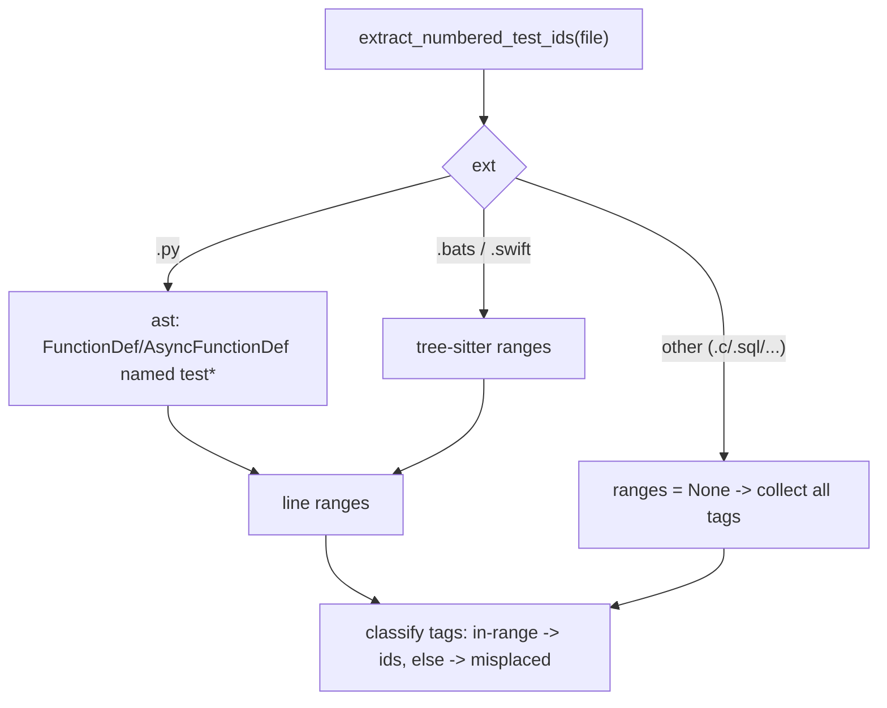

# Closure detection rework (ast + tree-sitter)

## Out of scope - do not touch (parallel runner)
Recent committed work added the parallel-runner improvements; this plan must not modify or revert them: [07_run_all_tests_parallel.sh](07_run_all_tests_parallel.sh), [11_run_all_self_tests_parallel.sh](11_run_all_self_tests_parallel.sh), [src/scripts/parallel_lane_test_count.py](src/scripts/parallel_lane_test_count.py), and their bats/requirements. The only shared files this plan edits are [requirements.in](requirements.in), the generated [requirements.txt](requirements.txt), and [03_prepare_supply_chain_integrity.sh](03_prepare_supply_chain_integrity.sh) (Phase 2 dependency wiring) - changes there must be purely additive (new tree-sitter entries / a new dev lockfile), leaving parallel-runner logic intact.

## Goal

Make `#Rxxx-Tnn` "inside a test block" detection parser-accurate instead of regex/brace/indent heuristics, fixing the false positives from braces/dedents inside strings, comments, heredocs, and interpolation. The only function that needs to change is the block detector; everything else (ID extraction, set-equality checks, anti-cheat) stays as-is.

## Where the change lives

The entire heuristic is in `extract_numbered_test_ids` in [tests/py/traceability/parsing.py](tests/py/traceability/parsing.py) (the brace counter + `_PYTHON_START_RE`/`_BATS_START_RE`/`_SWIFT_START_RE` regexes at lines 34-38, 182-262). Its contract must be preserved because [tests/py/traceability/verification.py](tests/py/traceability/verification.py) `collect_numbered_test_ids_from_list` (`:497-507`) consumes it:

```
def extract_numbered_test_ids(test_file: Path) -> tuple[list[str], list[str]]:
    # returns (sorted_ids, misplaced) where each misplaced entry is
    #   f"{test_file}:{line_number}: #{tag}"
```

## Design: a detection seam

Refactor `extract_numbered_test_ids` into:

- `_numbered_tags_on_lines(text) -> list[tuple[int, str]]` — reuse `NUMBERED_TEST_TAG_PATTERN` to yield `(line_number, tag)`.
- `_test_block_line_ranges(test_file, text) -> list[tuple[int,int]] | None` — language dispatch returning inclusive `(start_line, end_line)` ranges of test-function bodies. `None` means "no placement enforcement for this language" (current behavior for unknown extensions / C / SQL).
- A generic classifier: a tag is collected into `ids` if its line falls in any range; otherwise it goes to `misplaced` (only when ranges are not `None`). When ranges are `None`, collect all tags (preserves today's `enforce_scoped = False` path at `parsing.py:196-200`).




## Phase 1 - Python via stdlib `ast` (zero dependency, highest value)

In `_test_block_line_ranges`, for `.py`:

- `tree = ast.parse(text)` then walk with `ast.walk`, collecting every `FunctionDef`/`AsyncFunctionDef` whose `name.startswith("test")`.
- Use `(node.lineno, node.end_lineno)` as the inclusive body range. This is exact, handles nested defs/closures, multi-line strings/docstrings, decorators, and class methods (e.g. `class TestX: def test_y`) — all of which the indentation heuristic gets wrong.
- On `SyntaxError`: fall back to the existing indentation scan (kept as `_python_ranges_regex_fallback`) so an unparseable file never crashes the lane. Print nothing here; the broader lane still runs.

This phase is independently shippable and removes the entire indentation-heuristic bug class. The existing test `test_extract_numbered_test_ids_placement` (`.bats` fixture) is unaffected; add Python-specific tests (below).

## Phase 2 - bats/swift via tree-sitter

Add a loader `_load_treesitter()` that imports lazily and caches parsers/languages; if the import fails, return `None` and fall back to the current brace-counter (kept as `_brace_ranges_fallback`) so behavior degrades gracefully rather than hard-failing. A `STRICT_TRACEABILITY_TREESITTER=true` env flag (off by default, on in CI) can make a missing tree-sitter a hard error to avoid silently shipping the weaker detector.

- swift: query `function_declaration` nodes whose `name` field starts with `test`; range = node start/end row (+1 for 1-based lines). Matches XCTest `func testFoo() { ... }` and is brace/string/interpolation-safe.
- bats: `@test "desc" {` is not valid bash, so tree-sitter-bash won't parse it directly. Use a line-preserving shim: rewrite the leading `@test "..." {` token on its own line to `function _bats_test() {` (same line, so line numbers map 1:1), parse with tree-sitter-bash, then take `function_definition` ranges. Also keep covering the plain `name() {` and `bats_test_function` forms the current regex supports (`parsing.py:34-36`).

## Phase 3 - C / SQL (decision: defaulting to minimal)

Today `.c`/`.sql` set `enforce_scoped = False` and collect tags anywhere. Default in this plan: keep that behavior (ranges = `None`) so no new strictness is introduced for files that have no defined "test block" convention. If you want placement enforcement here, we need a convention first (e.g. C: functions named `test*`; SQL: a pgTAP-style block marker) — flagged as an open decision rather than implemented blindly.

## Dependency + supply-chain wiring (Phase 2 only)

tree-sitter is a test-tooling dependency, but the repo has only runtime ([requirements.in](requirements.in)) and security lockfiles, both hash-pinned via `pip-compile --generate-hashes` in [03_prepare_supply_chain_integrity.sh](03_prepare_supply_chain_integrity.sh).

- Recommended: add `tree-sitter` + `tree-sitter-language-pack` (prebuilt wheels, bundles bash/swift/c/sql grammars, avoids per-grammar native builds) rather than N separate grammar packages.
- Cleanest: introduce a dedicated dev/test lockfile (e.g. `requirements/dev/requirements-dev.in`) and wire it into [03_prepare_supply_chain_integrity.sh](03_prepare_supply_chain_integrity.sh) (`RUNTIME_IN_FILE`/lock pattern) and the dependency-freshness lane (`t02`). Simpler but less clean: add to [requirements.in](requirements.in) directly (pollutes the production runtime). Recommend the dev lockfile.
- Recompile hashes and re-run the supply-chain prep before committing.

## Tests

- Update/extend [tests/py/test_parsing.py](tests/py/test_parsing.py):
  - Python ast: tag inside a `def test_*`, tag inside a class method `test_*`, tag in a module-level non-test function (misplaced), tag inside a multi-line string that contains `}`/dedented text (must NOT break), syntax-error file falls back without crashing.
  - bats (tree-sitter): existing placement test plus a regression where a string/comment contains a stray `}` (today's brace counter closes early; new detector must keep the tag in-block).
  - swift: `func testFoo` with a trailing-closure `{ }` inside the body (brace nesting) and a `}` inside a string literal.
- Self-tests: the engine traces itself (`list_traceability_engine_files`, [tests/py/traceability/discovery.py](tests/py/traceability/discovery.py):20-36), so any new `#Rxxx`/`#Rxxx-Tnn` tags added to parsing.py must stay 1:1 with the t04 requirements doc and its `.bats`/`test_*.py` companions.
- Run `tests/t04_run_requirements_traceability_tests.sh`, the python unit lane (`t06`), and shell unit lane (`t05`).

## Risks / notes

- Contract preservation: keep `extract_numbered_test_ids`'s signature and the exact `misplaced` string format, or `verification.py` output changes.
- Graceful fallback keeps the lane green where tree-sitter can't load; the CI strict flag prevents that from masking real misplacement.
- bats `@test` shim must be line-preserving so reported line numbers stay correct.
- Adding a dev lockfile touches the supply-chain + dependency-freshness lanes; scope that in if chosen.

