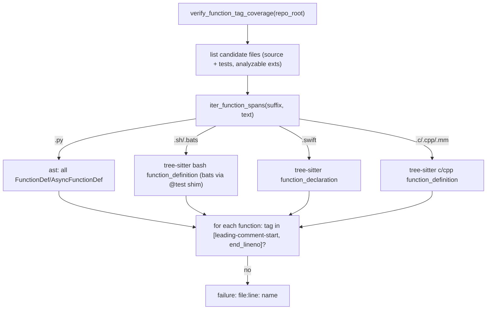

# Per-function requirement-tag gate

## What this adds
A new global traceability check: every parser-identifiable function must carry a scoped requirement tag (`#Rxxx:` or `#Rxxx-Tnn:`) in its leading comment block or body. Functions without one are reported as `repo/file:line: function_name`. This reuses the parser-accurate function-boundary machinery added in the closure-detection rework.

## Failure preview (measured, read-only, all 6 repos)
- ~2,476 untagged of ~4,346 functions (~57%).
- Per repo (untagged/total): runner 519/1085, classy 810/1250, teller 488/760, matchy 362/666, mailcart 271/559, eggnest 26/26.
- By language: `.py` 1344/1977, `.swift` 515/693, `.bats` 304/1234, `.sh` 217/307, `.cpp` 52/78, `.mm` 16/25, `.hpp` 2/2. `.sql` (78 files) and most `.c/.h` have no enumerable function nodes (reported as skipped, not failures).
- This includes the engine's own helpers (e.g. `parsing.py`: `_ts_value`, `_point_row`, `format_bulleted`, ...), so the gate cannot be on-by-default without first tagging every function.

## Design

### 1. Parsing primitive - [tests/py/traceability/parsing.py](tests/py/traceability/parsing.py)
- Generalize the existing test-only `_test_block_line_ranges` into an all-functions enumerator. `_treesitter_block_ranges(...)` already supports `name_prefix=None` (returns every node of a kind); add a thin `iter_function_spans(suffix, text) -> list[(name, start, end)]`:
  - `.py`: `ast` walk of all `FunctionDef`/`AsyncFunctionDef` (incl. nested, dunder, private), with `(lineno, end_lineno)`; `SyntaxError` -> skip file (report as unparsed).
  - `.sh`: tree-sitter `bash` `function_definition`; `.bats`: same via the existing line-preserving `_bats_to_bash` shim.
  - `.swift`: `function_declaration`; `.c/.h`: `c`; `.cc/.cpp/.cxx/.hpp/.m/.mm`: `cpp` (objc parses acceptably under cpp for function bodies).
  - Names for non-Python come from a start-line regex (already prototyped).
- Add `function_is_tagged(lines, start, end) -> bool`: a scoped tag (`FUNCTION_TAG_PATTERN = #Rxxx(-Tnn)?: <text>`) appears within `[lead_start, end]`, where `lead_start` walks upward over contiguous comment/decorator/blank lines above the def (matches the codebase convention of tagging the comment above a block).
- Add `find_untagged_functions(path: Path) -> list[tuple[str,int]]` tying it together; `None`/empty for unsupported suffixes.

### 2. Candidate files - [tests/py/traceability/discovery.py](tests/py/traceability/discovery.py)
- Add `list_function_tag_candidate_files(repo_root)`: union of the source universe (`list_repository_software_files`) and test trees, restricted to analyzable extensions, reusing the existing `excluded_dirs`/venv exclusions. For the eggnest umbrella, exclude the contained subrepo dirs (classy/mailcart/matchy/runner/teller) so they aren't double-counted.

### 3. Enforced check - [tests/py/traceability/verification.py](tests/py/traceability/verification.py)
- Add `verify_function_tag_coverage(self) -> bool`: iterate candidate files, collect untagged functions, print `❌ FAIL (function-tag-coverage): <n> functions missing a requirement tag:` followed by `format_bulleted("file:line: name")`; PASS when none.
- Gate it behind `STRICT_TRACEABILITY_FUNCTION_TAGS` (default `false`) using the existing `_env_flag_*` pattern, and call it from `verify_all_requirements` alongside the other global checks ([verification.py](tests/py/traceability/verification.py):66-76). Default-off prints an info-skip line, mirroring `STRICT_TRACEABILITY_FULL_COVERAGE`.

### 4. Self-coverage + tests
- The engine traces itself, so the new parsing/verification functions need scoped `#Rxxx:` tags + new requirement IDs/bullets in [parsing-requirements.md](requirements/tests/py/traceability/parsing-requirements.md) and [verification-requirements.md](requirements/tests/py/traceability/verification-requirements.md), with `#Rxxx-Tnn` tests in [test_parsing.py](tests/py/test_parsing.py) / [test_verification.py](tests/py/test_verification.py).
- New unit tests: tagged vs untagged function; private/nested/dunder counted; leading-comment tag counts as tagged; body tag counts; syntax-error file skipped; per-language (py/sh/bats/swift/c) detection.
- Keep the gate OFF in `runner.env` initially so existing self-checks (t04 46/46) stay green.

### 5. Rollout (because ~2,476 failures)
- Default off; opt-in per profile via `STRICT_TRACEABILITY_FUNCTION_TAGS="true"` once a repo's functions are tagged.
- Recommended ratchet: support an optional baseline-allowlist file (`config/traceability/function-tag-baseline.txt` of `file:line: name` currently-untagged entries) so a repo can enable the gate immediately, fail only on NEW untagged functions, and shrink the baseline over time. (Optional; say if you want it in v1.)

### 6. Full failure report
After implementing, run the check across all 6 repos and emit the complete `repo/file:line: function_name` list (all ~2,476) so you can see every failure; dump to an artifact (e.g. `artifacts/traceability/untagged-functions.txt`) in addition to stdout.

## Risks / notes
- `.sql` and pure-declaration `.c/.h` have no function nodes to enumerate; they are reported as skipped, not failures (could add pgTAP/`CREATE FUNCTION` support later).
- Turning the gate on for any repo is a large remediation (tag every function); the ratchet/baseline is the realistic path.
- tree-sitter must be installed for non-Python enumeration; honor the existing `STRICT_TRACEABILITY_TREESITTER` switch (graceful fallback would otherwise under-report non-Python functions).