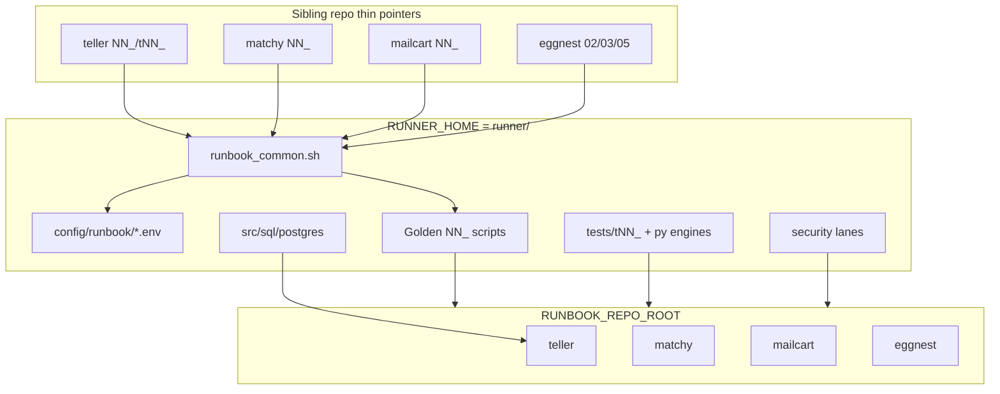

# Architecture

Runner is the shared runbook engine for the eggnest workspace. It holds the canonical ("golden") bash lifecycle
scripts, parallel test lanes, security tooling, PostgreSQL/SQLite DDL, per-repo profile configuration, and the
Python helpers that back requirements traceability and quality gates.

Runner is not a product runtime. It has no Matchy/Teller/Classy API. Application code lives in the sibling repos
(`teller`, `classy`, `matchy`, `mailcart`); runner parameterizes how those repos are set up, built, deployed,
and gated. Operator instructions live in [`README.md`](README.md).

> Note: runner is a nested git repository inside the eggnest workspace.

## Core Idea: Dual-Root Model

Every golden script keeps two locations distinct (see
[`src/scripts/runbook_common.sh`](src/scripts/runbook_common.sh)):

- `RUNNER_HOME` — where the golden scripts and shared helpers physically live (the `runner/` tree). Used for
  code/helper lookups.
- `RUNBOOK_REPO_ROOT` — the repository the golden operates on (its venv, `src/`, `config/`, `tests/`). Defaults
  to `RUNNER_HOME` for direct runs; thin pointers override it per repo.

The conventional venv name is derived as `<repo-basename>-venv` (for example `teller-venv`, `matchy-venv`).

## Thin-Pointer Pattern

Sibling repos do not copy logic. Each repo keeps a thin `NN_*.sh` (or `rNN_*.sh`) wrapper that sets
`RUNBOOK_REPO_ROOT`, sources a profile `.env`, and execs the runner golden:

```bash
RUNNER_HOME="$(cd "${SCRIPT_DIR}/../runner" && pwd)"
export RUNBOOK_REPO_ROOT="$SCRIPT_DIR"
source "${RUNNER_HOME}/config/runbook/<profile>.env"
exec "${RUNNER_HOME}/<golden>.sh" "$@"
```

These pointers are hand-authored per repo, not generated: each repo renumbers, re-prefixes, and selects its
own lane subset, so there is no uniform scheme to generate. Add or rename a golden, then update the affected
repo's pointer (and `tests/tNN_*` test pointer) by hand using the template above.

## Profile `.env` Mechanism

[`config/runbook/`](config/runbook/) holds one declarative profile per consuming repo. Profiles export knobs the
goldens read before executing; they are not secrets (secrets are referenced by 1psa item name).

| Profile | Shape |
|---------|-------|
| `eggnest.env` | Minimal: no prereq script, `VENV_EXISTS_POLICY=exit`, no pip bootstrap (cross-repo e2e only) |
| `teller.env` | Full stack: heavy Homebrew set, ZAP, 1psa, Xcode, Postgres install, pgTAP, hash-pinned pip, `parallel-discover` orchestrator, DAST targeting the classy API |
| `matchy.env` | Python/SAST focused: semgrep/ruff/bandit, `PYTHON_SRC_DIRS=matchy`, no Postgres/ZAP |
| `mailcart.env` | Swift/macOS: xcodegen, mkcert, Swift SAST prereq hook, Outlook Graph 1psa items, `PYTEST_DIR=tests/python` |
| `classy.env` | Verify-only prereqs, SQLCipher build, editable `../teller`, classifier DAST entrypoint |

## Layers



### Golden lifecycle scripts (`NN_*.sh`)

Numbered scripts that operate on `RUNBOOK_REPO_ROOT`: install prerequisites, create venv, prepare supply-chain
integrity, load requirements, deploy database, run test/security/AV/mutation/fuzz lanes, orchestrate parallel
runs, report/validate/prune quality telemetry, and back up/destroy/restore the database. `04_load_requirements.sh`
is a locked golden; the generic knob-driven loader is `src/scripts/load_requirements_generic.sh`.

### Test lanes (`tests/`)

`tests/tNN_*.sh` are thin lane wrappers that set flags and call shared engines. `src/scripts/run_unit_test_lanes.sh`
toggles shell (Bats), pytest, SQL (pg_prove/pgTAP), Swift, and macOS UI lanes. `07_run_all_tests_parallel.sh`
discovers `tests/t*.sh`, runs them in parallel, and writes telemetry.

### Traceability engine (`tests/py/traceability/`)

`TraceabilityVerifier` (`verification.py`), `discovery.py`, `parsing.py`, and `cli.py` map
`requirements/**/*-requirements.md` to source files and `#R###`-tagged tests. The `tests/t04_run_requirements_traceability_tests.sh`
lane prefers the target repo's `tests/py/traceability`, falling back to runner's copy.

### Data / schema layer (`src/sql/`)

`src/sql/postgres/` holds the full `teller` schema, including the match tables, plus a SQLite bootstrap. DB
automation is runner-hosted, but profile resolution is teller-owned:
[`src/scripts/db_profile_export.sh`](src/scripts/db_profile_export.sh) imports `teller.teller_db_profile` from
the target repo on `PYTHONPATH`. `config/db-profiles*.json` map profile names to 1psa items.

### Security lanes (`src/scripts/security/`)

`common.sh` resolves config assets repo-first then runner-fallback. `run_static_security_lane.sh` and
`run_dynamic_security_lane.sh` drive the full SAST/DAST pipelines (Semgrep, Bandit, Ruff, gitleaks,
detect-secrets, pip-audit, OWASP ZAP, Schemathesis).

## Asset Layering

When a golden needs a config asset or SQL file, it prefers the target repo's copy and falls back to runner's.
This lets a repo override security configs, SQL, or traceability packages while still sharing the common engine.

## Cross-Repo Roles

| Repo | Owns | Uses runner for |
|------|------|-----------------|
| `teller` | Bank ingest, `teller.*` schema, DB profiles, APIs | Full pipeline: prereqs -> venv -> DB -> parallel tests -> backup |
| `matchy` | Matching orchestration, AI ranker | SAST/unit/fuzz/mutation lanes (no full Postgres stack in profile) |
| `mailcart` | Outlook/Graph email API | Prereqs, TLS install, subset of test lanes |
| `classy` | Classification API + macOS UI | Verify prereqs, teller editable dep, DAST on classifier API |
| eggnest root | `harness/`, `cases/`, engine-level e2e | `02`/`03`/`05` only — offline matching verification |

The root [`../Architecture.md`](../Architecture.md) describes runtime flows (Matchy -> Mailcart -> Teller DB).
Runner describes how those repos are built, deployed, and gated — orthogonal to the HTTP/SQL runtime paths.

## Languages and Tooling

| Layer | Technology |
|-------|------------|
| Orchestration | Bash (`set -euo pipefail`, `umask 007`) |
| Automation/checks | Python 3.12+ (pytest, Hypothesis, mutmut, traceability, security gates) |
| Database | PostgreSQL DDL, SQLite; psql/pg_dump; pgTAP via pg_prove |
| Security | Semgrep, Bandit, Ruff, gitleaks, detect-secrets, pip-audit, OWASP ZAP, Schemathesis |
| macOS | Swift/Xcode lanes, bats-core |
| Secrets/TLS | 1psa (1Password), mkcert |
| Lockfiles | pip-tools (`pip-compile`), hash-pinned `requirements.txt` |

No Docker. Direct `pip install` is disallowed in consuming repos (use the numbered load-requirements script).
